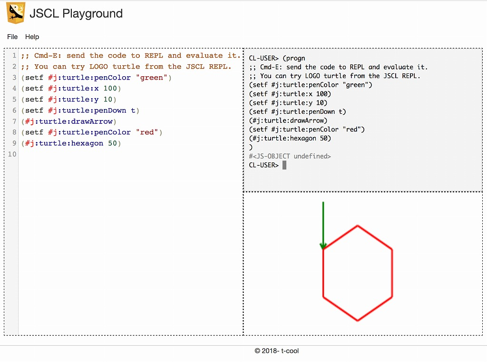

# JSCL Playground

## Screenshot

## Screencast

## Purpose

- To spread Common Lisp in the classrooms around the world.

## Method

- To develop JSCL Playground, a learning app developed using JSCL.

## About Playground

- Writing a CL code generates animation.

## How to play

- Please choose the examples from the menu above, and the lisp codes will be loaded.

- Typing Cmd+E(type E holding down Command key), the lisp code on the editor will be sent to the console and evaluated, as a result, generating animation on canvas.

## Status

- Now you can play with LOGO turtle.

- We will import other canvas examples from the book [Core HTML5 Canvas: Graphics, Animation, and Game Development by David Geary.](http://corehtml5canvas.com)

## Supported Browsers

- Firefox

- Chrome

## See Also

- [JSCL](https://github.com/jscl-project/jscl)

- [CodeMirror](https://codemirror.net/)

- [Core HTML5 Canvas: Graphics, Animation, and Game Development by David Geary](http://corehtml5canvas.com)
